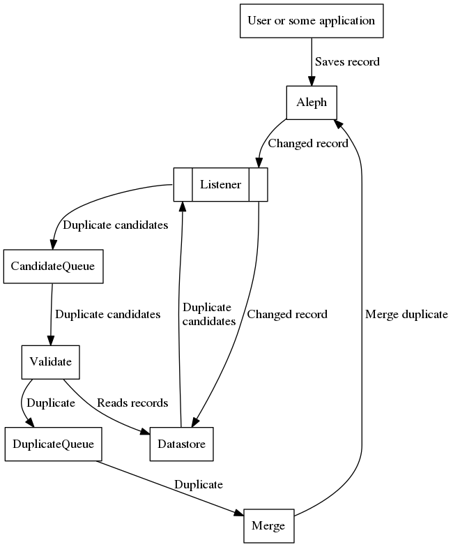

# Melinda deduplication system

System for detecting and removing duplicate MARC records in [Melinda, the Finnish national metadata repository](https://www.kansalliskirjasto.fi/en/services/metadata-reserve-services/melinda).

## Micro services

The system is implemented as micro services. Each service also depends on shared code implemented as a [Javascript module](https://github.com/NatLibFi/melinda-deduplication-common).

### Listener

[Listener](https://github.com/NatLibFi/melinda-deduplication-listener) listens for any changes in Aleph and saves changed records to the datastore. It will also get duplicate candidates from datastore for every changed record and pushes them to the CandidateQueue. So whenever a record is changed, Listener triggers the system to check if there are any duplicate records for the just saved record.

### Datastore

[Datastore](https://github.com/NatLibFi/melinda-deduplication-datastore) contains a copy of every record in Aleph. It also has indices for querying duplicate candidates. These services are provided over http api.

### Validate

[Validate](https://github.com/NatLibFi/melinda-deduplication-validate) reads duplicate candidates from CandidateQueue and classifies the candidates as a duplicate or not duplicate. Candidates that are classified as duplicate are then pushed to the DuplicateQueue. The duplicate candidate information contains only the record id-numbers, so the actual records are fetched from the Datastore.

### Merge

[Merge](https://github.com/NatLibFi/melinda-deduplication-merge) reads duplicates from DuplicateQueue and merges them in Aleph. In case automatic merging is not possible then the duplicate is pushed into the duplicate database (which is not part of this system).

### Queues

There are 2 queues in the system. One for duplicate candidates (before validate) and another for validated duplicates (before merge). Queues are implemented with RabbitMQ.

## Overview of the flow

